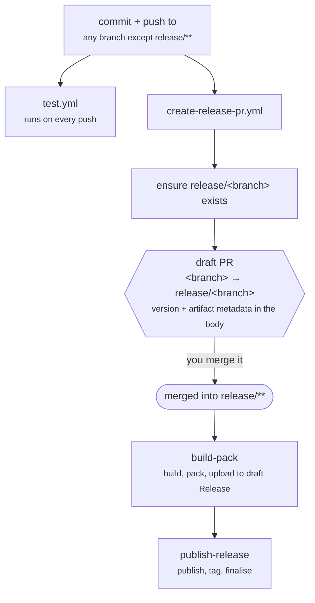

# Branch Model

Two rules define the entire model.

> **Every branch has a corresponding `release/` branch.**
>
> **A branch name containing `/` is a development branch and can never publish a stable version.
> A branch name without `/` is a mainline branch and can.**

Everything else — versioning, tagging, what the workflows do — follows from these.

> This is not the branching model published by Vincent Driessen, which is also commonly called
> "git flow". There is no `develop` branch, no `hotfix/` convention, and no short-lived
> `release/1.2.3` branch that gets deleted after a release. Here, `release/<branch>` is a permanent
> mirror of the branch it releases.

## Branch types

| Branch                            | Type        | Release branch                            | Can publish stable?     |
| --------------------------------- | ----------- | ----------------------------------------- | ----------------------- |
| `main`                            | mainline    | `release/main`                            | yes                     |
| `v1`, `v2.4`                      | mainline    | `release/v1`                              | yes                     |
| `feature/checkout`                | development | `release/feature/checkout`                | no — always pre-release |
| `fix/rounding`                    | development | `release/fix/rounding`                    | no                      |
| `team/frontend/feature/dark-mode` | development | `release/team/frontend/feature/dark-mode` | no                      |

Nesting is unrestricted. Any branch, at any depth, gets a release branch and can publish a
pre-release; the depth only affects how the branch name is rendered into the version string.

## Why stability is encoded in the branch name

The alternative designs all require somebody to maintain a list: a set of protected branch names, a
config file of "release branches", a label on the pull request. Each of those can be edited, and
each of them can be edited by the person who wants a stable release out of a feature branch.

Putting the rule in the branch name makes the question _"can this branch publish a stable
version?"_ answerable by looking at the branch, from any tool, with no configuration to consult and
nothing to keep in sync. A feature branch cannot accidentally publish `2.1.0`, because there is no
setting that would let it.

The cost is one convention you have to remember, and it is a real one:

> **Maintenance lines must be named `v1`, `v1.8`, `v2` — never `v/1`.**
>
> A slashed name is a development branch by definition, so `v/1` would silently become incapable of
> publishing a stable patch. The failure is quiet: releases still happen, they are just all
> pre-releases.

## Why a release branch rather than a tag on the source branch

Tagging the branch you work on is simpler, and it was rejected for four reasons.

**The pull request is the review surface.** Every push refreshes a draft pull request from
`<branch>` into `release/<branch>`. Before anything is published, you can see the complete diff
since the last release, the resolved version of every project, and which artifacts each will
produce. Merging it is the release.

**The merge is an unambiguous trigger.** `build-pack-publish.yml` fires on a pull request merged
into `release/**`. There is no ambiguity about whether a given commit was meant to be released,
which a tag-on-push scheme has to solve with commit-message conventions or manual dispatch.

**The pull request body carries the release metadata.** The resolved version for each project is
written into a YAML block in the PR body when the PR is updated, and read back by `build-pack` and
`publish-release`. The versions that get built are the versions you reviewed, not versions
recomputed at build time from a moving branch.

**The release line has its own history.** `release/main` accumulates exactly the merges that were
released. It can carry its own branch protection, and "what is in the last release" is a branch you
can diff against rather than a tag you have to look up.

## The flow

1. You commit to any branch. `release/<branch>` is created if it does not exist.
2. A draft pull request from `<branch>` into `release/<branch>` is created or updated, carrying the
   resolved versions.
3. Tests run on the same push, independently.
4. When you merge the pull request, the release runs.

Pushes to `release/**` itself trigger nothing — both `create-release-pr.yml` and `test.yml` use
`branches-ignore: release/**`. The release branch is an output, not somewhere you work.

## Maintenance lines

A maintenance line is an ordinary mainline branch kept alive to patch an older release. `v1.3` is a
branch like any other: no slash, so it can publish stable versions, and it gets `release/v1.3`.

What keeps it on the `1.3.x` track is that **the versions file is branch-specific**. `main` and
`v1.3` both use the `MAIN` version key, and each branch's own copy of `.publish/versions.yml`
resolves that key differently:

| Branch | `.publish/versions.yml`     | Resolves to    |
| ------ | --------------------------- | -------------- |
| `main` | `"0.0.0-MAIN": 2.2.0-dev.0` | the 2.x line   |
| `v1.3` | `"0.0.0-MAIN": 1.3.5`       | the 1.3.x line |

There is no separate version key for a maintenance line and no branch-to-version mapping to
configure. Cutting a maintenance line is: branch from the release point, set the version on the new
branch, push. See [Versioning](Versioning).

## How the branch name reaches the version

Development branches carry their name in the version's pre-release identifier, so any build from
any branch is traceable to the branch that produced it:

| Branch                            | Version becomes                         |
| --------------------------------- | --------------------------------------- |
| `main`                            | `2.1.0`                                 |
| `feature/checkout`                | `2.1.0-feature.checkout`                |
| `team/frontend/feature/dark-mode` | `2.1.0-team.frontend.feature.dark-mode` |

Slashes become dots, and any character that is not valid in a semver identifier becomes a dot.
Because the name is inserted as a pre-release identifier, the resulting version sorts below the
stable version it is based on — a feature build of `2.1.0` is never mistaken for `2.1.0` itself by
a semver range.

The full rules, including what happens when a version has already been released, are in
[Versioning](Versioning).

## What this model does not do

Recorded so they are not mistaken for gaps:

- **No automatic merge back.** Merging a fix from `v1.3` into `main` is a normal pull request you
  open yourself.
- **No enforced promotion path.** Nothing requires a version to reach `main` before a maintenance
  branch, or a development environment before production. Environment protection rules in GitHub
  are the tool for that.
- **No deploy on merge.** Merging the release pull request publishes; it does not deploy. See
  [Deployment](Deployment).
