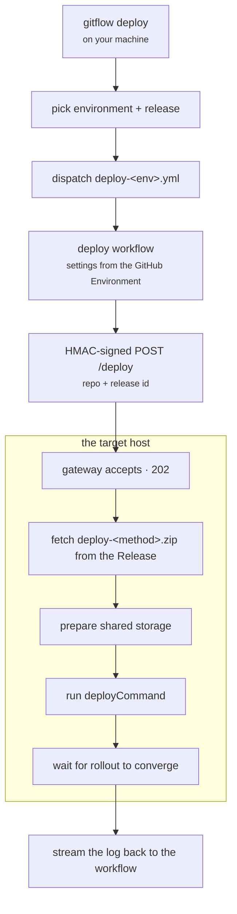

# Deployment

Publishing a release makes a version available. Deploying decides that a particular environment
should run it. git-flow keeps those two decisions apart: **merging a release pull request never
deploys anything**, and a deploy is started by a person running `gitflow deploy`.

The reason is that they answer different questions. Publishing asks "is this version good?";
deploying asks "should production be running it right now?" Coupling them removes the second
question, and with it the ability to publish a version you are not yet ready to run.

## How a deploy travels



**The workflow never reaches into the target host.** It makes one signed HTTPS call; the gateway
pulls the bundle itself and streams the log back. There is no SSH key, and no inbound access from
CI to the host beyond that one endpoint.

**Images are never carried in the bundle.** `deploy-<method>.zip` is orchestration only —
stack files, compose files, the manifest. Images always come from a registry.

## Environments

An environment is a workflow file. `gitflow deploy` lists the environments it can deploy to by
looking for `.github/workflows/deploy-<env>.yml` on the release branch.

```
.github/workflows/
├── deploy-development.yml
└── deploy-production.yml
```

Each is a thin wrapper that pins `environment:` and calls the `deploy` action, so the URL, the HMAC
secret and the allowed methods come from that GitHub Environment's variables and secrets rather than
from the workflow file.

| Setting                  | Usual source                                                |
| ------------------------ | ----------------------------------------------------------- |
| `DEPLOY_URL`             | Environment variable                                        |
| `DEPLOY_HMAC_SECRET`     | Environment secret                                          |
| `DEPLOY_TYPE_DEFAULT`    | Environment variable — the method to use when none is given |
| `DEPLOY_ALLOWED_METHODS` | Environment variable                                        |

Adding an environment is adding a `deploy-<env>.yml` and configuring the GitHub Environment. There
is no environment list to maintain anywhere in git-flow.

## `gitflow deploy`

```bash
gitflow deploy
gitflow deploy --target production --package @org/api --version latest --yes
```

The command resolves your branch to its release branch, lists the environments available there, and
lists the releases that branch produced. Two shorthands:

| Selector | Means                                                            |
| -------- | ---------------------------------------------------------------- |
| `latest` | The highest **stable** release. Only mainline branches have one. |
| `next`   | The highest release overall, including pre-releases.             |

A feature branch has no stable release, so `latest` is empty there and `next` is what you deploy —
which is the branch model showing through: a development branch cannot produce a stable version, so
it cannot offer one to deploy.

Dispatching starts one run of the chosen environment's workflow per selected release.

## The bundle

Each artifact that declares `deploy:` produces one `deploy-<method>.zip` per method, attached to the
GitHub Release. Every bundle contains a `deploy.yml` manifest.

| Field                                  | Set by                            | Meaning                                    |
| -------------------------------------- | --------------------------------- | ------------------------------------------ |
| `deployCommand`                        | the method handler or your bundle | **Required.** The command the gateway runs |
| `teardownCommand`                      | the method handler                | Used when a deployment's mode changes      |
| `name`, `version`, `repo`, `releaseId` | git-flow                          | Identity of what is being deployed         |
| `method`, `slot`, `versioning`         | git-flow                          | Filled in if the bundle did not set them   |
| `service`, `stack`                     | artifact keys or defaults         | Identity used for names and storage paths  |
| `sharedStorage`, `seedStorage`         | artifact keys                     | Directories that persist or are seeded     |

Pack fails if `deploy.yml` is missing or has no `deployCommand`.

Storage paths are validated at pack time as well as on the deploy side: they must be relative and
must not contain `..`, so a bundle cannot write outside its storage root.

## Slots

A **slot** is the identity under which an instance runs on the host and is replaced. It drives the
compose project name, the swarm stack name, per-slot state and self-detection.

| `versioning`          | Slot         | Effect                                                    |
| --------------------- | ------------ | --------------------------------------------------------- |
| `singleton` (default) | `org-api`    | Deploying replaces the running instance                   |
| `major`               | `org-api-v2` | Each major version runs as its own instance, side by side |

`versioning: major` requires the deploy method to declare `supportsParallelMajors`. Running two
majors together means every shared identity — service name, published ports, volume names — must be
derived from the slot; a handler that has not done that work would silently collide with the major
already running, so it is refused rather than attempted.

## Templating

Every text file in the bundle is rendered with the deployment's identity, so these values can appear
in YAML keys and other places runtime environment interpolation cannot reach:

| Token                      | Value                                                     |
| -------------------------- | --------------------------------------------------------- |
| `{{SERVICE}}`              | Unscoped package name, or the `service` override          |
| `{{SERVICE_ID}}`           | `SERVICE`, suffixed `_v<major>` under `versioning: major` |
| `{{STACK}}`                | Package scope, or the `stack` override                    |
| `{{STACK_SERVICE_ID}}`     | What docker names the running service                     |
| `{{STACK_SERVICE}}`        | The same, without the version — stable across majors      |
| `{{VERSION}}`, `{{MAJOR}}` | The release version and its major                         |

## Deploy methods

`compose` and `swarm` ship with git-flow, for both `docker-image` and `docker-service`. A method is
resolved per artifact type — `swarm` for a `docker-image` is a different registration from `swarm`
for anything else, because the two would not do the same thing.

A project overrides or replaces a method by dropping files in `.deploy/<method>/`, adding a
`github.actions.pack-deploy-<method>` script, or installing a [plugin](Plugins). See
[Project Structure](Project-Structure).

## The receiving end

The host runs a **deploy gateway**: an HTTP service that verifies the HMAC signature, checks that
the calling repository is authorised, fetches the bundle, runs it and streams the log back.

git-flow ships two pieces for this:

- **`@cpdevtools/git-flow-deploy`** — the framework-free core: manifest parsing, HMAC, bundle fetch,
  shared storage, slots, swarm rollout, repository rules.
- **`@cpdevtools/git-flow-deploy-cli`** — the `deploy-gateway` CLI, run on the host.

**`@cpdevtools/git-flow-deploy-service`** is a reference gateway built on the core. It is a working
example rather than an operated product; a real deployment can use it, wrap the CLI, or implement
the endpoint itself. See [Packages](Packages).
