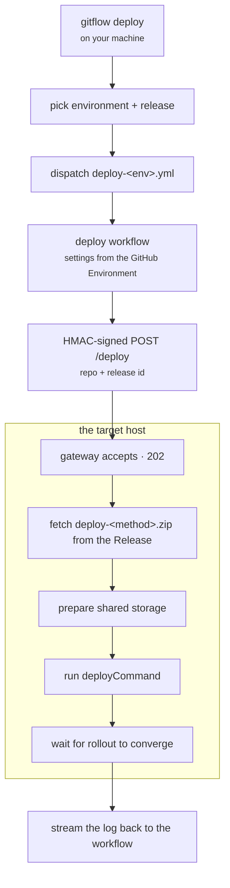

# Deployment

Publishing a release makes a version available. Deploying decides that a particular environment
should run it. git-flow keeps those two decisions apart: **merging a release pull request never
deploys anything**, and a deploy is started by a person running `gitflow deploy`.

The reason is that they answer different questions. Publishing asks "is this version good?";
deploying asks "should production be running it right now?" Coupling them removes the second
question, and with it the ability to publish a version you are not yet ready to run.

## How a deploy travels


```mermaid
flowchart TD
    cli["gitflow deploy<br/><small>on your machine</small>"] --> pick["pick environment + release"]
    pick --> disp["dispatch deploy-&lt;env&gt;.yml"]
    disp --> wf["deploy workflow<br/><small>settings from the GitHub Environment</small>"]
    wf --> post["HMAC-signed POST /deploy<br/><small>repo + release id</small>"]
    post --> gw

    subgraph host["the target host"]
        gw["gateway accepts · 202"] --> fetch["fetch deploy-&lt;method&gt;.zip from the Release"]
        fetch --> store["prepare shared storage"]
        store --> run["run deployCommand"]
        run --> conv["wait for rollout to converge"]
    end

    conv --> logs["stream the log back to the workflow"]
```

**The workflow never reaches into the target host.** It makes one signed HTTPS call; the gateway
pulls the bundle itself and streams the log back. There is no SSH key, and no inbound access from
CI to the host beyond that one endpoint.

**Images are never carried in the bundle.** `deploy-<method>.zip` is orchestration only —
stack files, compose files, the manifest. Images always come from a registry.

## Environments

An environment is a workflow file. `gitflow deploy` lists the environments it can deploy to by
looking for `.github/workflows/deploy-<env>.yml` on the release branch.

```
.github/workflows/
├── deploy-development.yml
└── deploy-production.yml
```

Each is a thin wrapper that pins `environment:` and calls the `deploy` action, so the URL, the HMAC
secret and the allowed methods come from that GitHub Environment's variables and secrets rather than
from the workflow file.

| Setting                  | Usual source                                                |
| ------------------------ | ----------------------------------------------------------- |
| `DEPLOY_URL`             | Environment variable                                        |
| `DEPLOY_HMAC_SECRET`     | Environment secret                                          |
| `DEPLOY_TYPE_DEFAULT`    | Environment variable — the method to use when none is given |
| `DEPLOY_ALLOWED_METHODS` | Environment variable                                        |

Adding an environment is adding a `deploy-<env>.yml` and configuring the GitHub Environment. There
is no environment list to maintain anywhere in git-flow.

A workflow does not have to hand the bundle to a gateway. For a target with no persistent host —
GitHub Pages — the same `deploy-<env>.yml` fetches the bundle and runs its `deployCommand` inside
the job, using the job's own `GITHUB_TOKEN`. See [`gh-pages`](#gh-pages-static-site) below.

## `gitflow deploy`

```bash
gitflow deploy
gitflow deploy --target production --package @org/api --version latest --yes
```

The command scans the repository's deployable releases once and narrows that list with each choice:

1. **Environment** — the `deploy-*.yml` workflows on your branch's release branch (else the default
   branch's). Releases with no method in `DEPLOY_ALLOWED_METHODS` drop out.
2. **Branch** — the source branches those releases were cut from, your current branch preselected.
   A branch that is gone from origin is still listed, marked `(deleted)`.
3. **Version** — the versions that branch produced, across all packages.
4. **Packages** — only the packages that have a release at that version. You pick one version, and
   the version decides what can be deployed; there is no per-package version.

A release is mapped to its branch by the `branch` key in its Artifact Metadata. Releases that
predate that key are mapped through their release PR's head branch, and failing that by the branch
embedded in the version (`3.0.0-erd.wire-cut.alpha.1` came from `erd/wire-cut`).

Two version shorthands:

| Selector | Means                                                            |
| -------- | ---------------------------------------------------------------- |
| `latest` | The highest **stable** release. Only mainline branches have one. |
| `next`   | The highest release overall, including pre-releases.             |

A feature branch has no stable release, so `latest` is empty there and `next` is what you deploy —
which is the branch model showing through: a development branch cannot produce a stable version, so
it cannot offer one to deploy.

### Which ref the workflow runs on

The workflow is dispatched on the release branch of the **selected release's** source branch, not
of your checkout. The first of these that exists on origin and contains the environment's workflow
file wins; `--ref` overrides the lot:

| Order | Ref                                   |
| ----- | ------------------------------------- |
| 1     | `release/<source>`, then `<source>`   |
| 2     | `release/<current>`, then `<current>` |
| 3     | `release/<default>`, then `<default>` |

So with `main`, `release/main`, `feature/wirecut`, `release/feature/wirecut` and `qq/asdf` on
origin: `3.0.0-alpha.2` runs on `release/main`, `3.0.0-feature.wirecut.alpha.2` on
`release/feature/wirecut`, `3.0.0-qq.asdf.alpha.2` on `qq/asdf`, and `3.0.0-www.qwerty.alpha.2`
(branch deleted) on your current branch's ref, else `release/main`.

Dispatching starts one run of the chosen environment's workflow per selected release.

### Withdrawn releases

A release withdrawn with [`gitflow withdraw`](Withdrawing) advertises its methods but is not offered:
`--include-withdrawn` shows it with its kind and reason. The deploy side refuses it unless the kind
allows `--force`.

## The bundle

Each artifact that declares `deploy:` produces one `deploy-<method>.zip` per method, attached to the
GitHub Release. Every bundle contains a `deploy.yml` manifest.

| Field                                  | Set by                            | Meaning                                    |
| -------------------------------------- | --------------------------------- | ------------------------------------------ |
| `deployCommand`                        | the method handler or your bundle | **Required.** The command the gateway runs |
| `teardownCommand`                      | the method handler                | Used when a deployment's mode changes      |
| `name`, `version`, `repo`, `releaseId` | git-flow                          | Identity of what is being deployed         |
| `method`, `slot`, `versioning`         | git-flow                          | Filled in if the bundle did not set them   |
| `service`, `stack`                     | artifact keys or defaults         | Identity used for names and storage paths  |
| `sharedStorage`, `seedStorage`         | artifact keys                     | Directories that persist or are seeded     |

Pack fails if `deploy.yml` is missing or has no `deployCommand`.

Storage paths are validated at pack time as well as on the deploy side: they must be relative and
must not contain `..`, so a bundle cannot write outside its storage root.

## Slots

A **slot** is the identity under which an instance runs on the host and is replaced. It drives the
compose project name, the swarm stack name, per-slot state and self-detection.

| `versioning`          | Slot         | Effect                                                    |
| --------------------- | ------------ | --------------------------------------------------------- |
| `singleton` (default) | `org-api`    | Deploying replaces the running instance                   |
| `major`               | `org-api-v2` | Each major version runs as its own instance, side by side |

`versioning: major` requires the deploy method to declare `supportsParallelMajors`. Running two
majors together means every shared identity — service name, published ports, volume names — must be
derived from the slot; a handler that has not done that work would silently collide with the major
already running, so it is refused rather than attempted.

## Templating

Every text file in the bundle is rendered with the deployment's identity, so these values can appear
in YAML keys and other places runtime environment interpolation cannot reach:

| Token                      | Value                                                     |
| -------------------------- | --------------------------------------------------------- |
| `{{SERVICE}}`              | Unscoped package name, or the `service` override          |
| `{{SERVICE_ID}}`           | `SERVICE`, suffixed `_v<major>` under `versioning: major` |
| `{{STACK}}`                | Package scope, or the `stack` override                    |
| `{{STACK_SERVICE_ID}}`     | What docker names the running service                     |
| `{{STACK_SERVICE}}`        | The same, without the version — stable across majors      |
| `{{VERSION}}`, `{{MAJOR}}` | The release version and its major                         |

Files that are payload rather than templates — a built site, vendored assets — are excluded with
`templateIgnore`, a list of bundle-relative globs (`**` spans directories, `*` and `?` do not).
A method handler declares its own (`gh-pages` excludes `site/**`); an artifact adds more:

```yaml
artifacts:
  - type: static-site
    deploy: [gh-pages]
    templateIgnore: ['vendor/**']
```

Files containing no `@{`, `@%` or `@#` are never parsed, so the list only matters for content that
happens to contain a delimiter.

## Deploy methods

`compose` and `swarm` ship with git-flow, for both `docker-image` and `docker-service`. A method is
resolved per artifact type — `swarm` for a `docker-image` is a different registration from `swarm`
for anything else, because the two would not do the same thing.

A project overrides or replaces a method by dropping files in `.deploy/<method>/`, adding a
`github.actions.pack-deploy-<method>` script, or installing a [plugin](Plugins). See
[Project Structure](Project-Structure).

### `gh-pages` (static-site)

Publishes a [`static-site`](Artifacts#static-site) artifact to the repository's `gh-pages` branch.
GitHub Pages serves one branch per repository, so every deploy target gets its own directory on
that branch and never touches another's:

| Target                      | `versioning: singleton` | `versioning: major`     |
| --------------------------- | ----------------------- | ----------------------- |
| production                  | `/org-site/`            | `/org-site/v2/`         |
| any other environment `dev` | `/env/dev/org-site/`    | `/env/dev/org-site/v2/` |

The folder is the [slot](#slots) written as a path, so two majors can be served side by side and
the method declares `supportsParallelMajors`. Production is simply the target with no prefix.

The environment contributes only the prefix, through the ordinary `DEPLOY_ENV` lines:

| Variable        | Production          | Other environments | Notes                                                                                 |
| --------------- | ------------------- | ------------------ | ------------------------------------------------------------------------------------- |
| `GH_PAGES_DEST` | _(unset)_           | `env/dev`          | Directory prefix on the branch                                                        |
| `PAGES_ROOT`    | _(unset = `/repo`)_ | _(same)_           | URL path Pages serves the branch at. Set empty for a custom domain or a user/org site |

At deploy time the site's `<base href>` is rewritten to `PAGES_ROOT/GH_PAGES_DEST/<slot path>/`,
so the project builds with its default base and is correct wherever it lands. A `.nojekyll` is kept
at the branch root so `_`-prefixed build output (`_astro/`) is served.

**The Pages root.** With every project in its own folder, `/` itself holds nothing. One
`static-site` artifact per repository may set `pagesRoot: true` to own it: its files land directly
at `/` (or at `/env/<env>/`), beside the other projects' folders. That site must be a singleton —
there is no version folder for it to live in. Because it shares its directory, its deploy does not
wipe anything: it records what it wrote in `.gitflow/root.files` and removes exactly those paths
next time. A second artifact claiming the root is refused at deploy time. The root site also owns
the branch's `404.html`, which Pages uses as the fallback for every path.

**Running it.** There is no host to pull the bundle, so the environment's `deploy-<env>.yml` runs
it in the job. The workflow needs `contents: write`, and the repository's Pages source must be set
to the `gh-pages` branch.

```yaml
permissions:
  contents: write

jobs:
  deploy:
    runs-on: ubuntu-latest
    environment: 'Development'
    steps:
      - name: Deploy to GitHub Pages
        env:
          GITHUB_TOKEN: ${{ secrets.GITHUB_TOKEN }}
          DEPLOY_ENV_LINES: |
            ${{ vars.DEPLOY_ENV }}
            ${{ inputs.deploy_env }}
        run: |
          while IFS= read -r line; do
            case "$line" in ''|'#'*) ;; *=*) export "$line" ;; esac
          done <<< "$DEPLOY_ENV_LINES"
          pnpm config set "//npm.pkg.github.com/:_authToken" "$GITHUB_TOKEN"
          pnpm config set @cpdevtools:registry https://npm.pkg.github.com
          pnpm dlx @cpdevtools/git-flow-deploy-cli deploy "$GITHUB_REPOSITORY" \
            "${{ inputs.release_id }}" --bundle deploy-gh-pages.zip
```

The full workflow, including tag-to-id resolution for `release_id`, ships in the template
repository as `deploy-gh-pages.yml.example`.

Retention is the project's concern: nothing removes `env/*` directories when a branch or
environment goes away.

## The receiving end

The host runs a **deploy gateway**: an HTTP service that verifies the HMAC signature, checks that
the calling repository is authorised, fetches the bundle, runs it and streams the log back.

git-flow ships two pieces for this:

- **`@cpdevtools/git-flow-deploy`** — the framework-free core: manifest parsing, HMAC, bundle fetch,
  shared storage, slots, swarm rollout, repository rules.
- **`@cpdevtools/git-flow-deploy-cli`** — the `deploy-gateway` CLI, run on the host.

**`@cpdevtools/git-flow-deploy-service`** is a reference gateway built on the core. It is a working
example rather than an operated product; a real deployment can use it, wrap the CLI, or implement
the endpoint itself. See [Packages](Packages).
