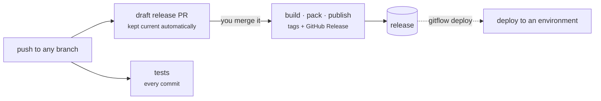

# git-flow

Release automation for pnpm/TypeScript and .NET monorepos. It takes a branch from commit through
versioned build, published packages and live deployment, driven by GitHub Actions and the `gitflow`
CLI.

The system is **event-driven**. Pushing to a branch keeps a draft release pull request up to date.
**Merging that pull request is what builds, packs and publishes.** Deploying is a separate step that
you start from the CLI. Tests run on every commit, independent of the release line.

## The shape of it

## Start here

- **[Branch Model](Branch-Model)** — the central rule, and what it buys you. Read this first.
- **[Versioning](Versioning)** — version keys, placeholders, and how a version is resolved.
- **[Release Pipeline](Release-Pipeline)** — what happens between a push and a published release.
- **[Adopting git-flow](Adopting-git-flow)** — the checklist for putting a repository on it.

## How a repository is arranged

- [Repository Structure](Repository-Structure) — what lives at the root of a managed repository.
- [Project Structure](Project-Structure) — what each project inside it has to provide.
- [Artifacts](Artifacts) — declaring what a project produces.
- [Registries](Registries) — declaring where those artifacts go.

## Reference

- [Deployment](Deployment) — deploy bundles, methods, slots, and the gateway contract.
- [Plugins](Plugins) — adding artifact types and deploy methods.
- [CLI](CLI) — the `gitflow` commands.
- [Actions and Workflows](Actions) — the composite actions and reusable workflows.
- [Packages](Packages) — the five packages this repository publishes.
- [Gotchas](Gotchas) — behaviour that is correct by design but easy to misread.

## What it assumes

git-flow is opinionated, and the opinions are load-bearing rather than stylistic. In short:

| Opinion                                                         | Consequence                                                                     |
| --------------------------------------------------------------- | ------------------------------------------------------------------------------- |
| Every branch has a matching `release/` branch                   | The release line is a branch, so it has history, permissions and a diff         |
| A branch name containing `/` can never publish a stable version | Stability is a property of the branch name, checkable without configuration     |
| Versions live in one file, not in manifests                     | No version churn in `package.json`, and no merge conflicts over version numbers |
| Merging the release PR is the release trigger                   | There is one deliberate human action, and it is reviewable                      |
| Deploying is initiated by a person, not by a merge              | Publishing and deploying are separate decisions                                 |

Each of these is explained where it matters — the first two in [Branch Model](Branch-Model), the
third in [Versioning](Versioning), the last two in [Release Pipeline](Release-Pipeline) and
[Deployment](Deployment).
