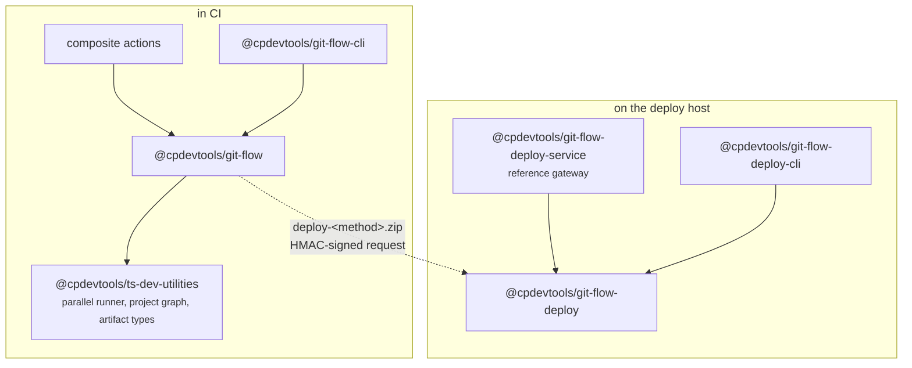

# Packages

Five packages, published to GitHub Packages under the `@cpdevtools` scope. They divide along where
the code runs: two in CI, three on a deploy host.

```
git-flow/
├── packages/
│   ├── git-flow/                 core library — runs in CI
│   ├── git-flow-cli/             the gitflow CLI — runs in CI and on your machine
│   ├── git-flow-deploy/          deploy core — runs on the target host
│   ├── git-flow-deploy-cli/      deploy-gateway CLI — runs on the target host
│   └── git-flow-deploy-service/  reference gateway — runs on the target host
├── actions/                      seven composite actions
├── .github/workflows/            this repository's own workflows, plus reusable ones
└── wiki/                         these pages
```

## `@cpdevtools/git-flow`

The core library: version resolution, branch classification, build/pack orchestration, publishing,
and the artifact and deploy-method registries. The composite actions are thin layers over it.

| Entry point    | Contents                                                                            |
| -------------- | ----------------------------------------------------------------------------------- |
| `.`            | Everything below, re-exported                                                       |
| `./artifacts`  | Artifact types, the plugin contract, deploy-method registry — what a plugin imports |
| `./publishing` | Registry configuration and publishers                                               |

A [plugin](Plugins) should import from `./artifacts` using `import type` only.

## `@cpdevtools/git-flow-cli`

The `gitflow` binary — `version`, `deploy`, `pack`, `pack-deploy`, `apply-version`. Built on oclif.
See [CLI](CLI).

Install it in any repository git-flow manages: projects call `gitflow pack` from their
`github.actions.pack` script, and you call `gitflow version` and `gitflow deploy`.

## `@cpdevtools/git-flow-deploy`

Framework-free deploy core, for the receiving end: manifest parsing and validation, HMAC signing and
verification, bundle fetch, shared storage preparation, deployment slots, swarm rollout monitoring,
and repository authorisation rules.

No HTTP framework and no process supervision — it is the logic a gateway needs, so a gateway can be
built with whatever stack suits the host.

## `@cpdevtools/git-flow-deploy-cli`

The `deploy-gateway` CLI, installed on the deploy host. Wraps the core for use from a shell or a
service:

| Area          | Commands                                                                                 |
| ------------- | ---------------------------------------------------------------------------------------- |
| Deploying     | `deploy`, `run`, `fetch`                                                                 |
| Signing       | `hmac sign`, `hmac verify`                                                               |
| Authorisation | `repos list`, `repos check`, `repos allow add/remove/list`, `repos deny add/remove/list` |
| Swarm         | `swarm status`                                                                           |

## `@cpdevtools/git-flow-deploy-service`

A reference deploy gateway built on the core, published as an npm package and a Docker image. It
implements the HMAC-verified `POST /deploy` endpoint, log streaming, deployment state and the
self-update supervisor.

**It is a reference implementation.** It shows what a gateway must do and is a working starting
point, but a production deployment may equally wrap the CLI or implement the endpoint itself.

> **`SupervisorPlan` is additive-only and optional-only.** During a self-update the _outgoing_
> release's supervisor executes the plan written by the _incoming_ one. A newly required field
> therefore breaks upgrades from every existing version — new fields must always be optional.

## How the pieces relate



The two halves share only a contract — the bundle format and the signed request — not a runtime.

## Relationship to ts-dev-utilities

git-flow builds on
[`@cpdevtools/ts-dev-utilities`](https://github.com/cpdevtools/ts-dev-utilities/wiki) for the
parallel script runner, project discovery and the artifact descriptor types. That library is
deliberately generic: it knows about projects, scripts and dependency graphs, and nothing about
releases, tags or GitHub. Everything release-shaped lives here.

The two repositories are released together, so each excludes the other from pnpm's
minimum-release-age check.

## Developing this repository

```bash
pnpm install
pnpm build
pnpm test
pnpm lint
pnpm format
```

Set `DEV_LOCAL=true` to resolve `@cpdevtools/ts-dev-utilities` and `@cpdevtools/git-flow` from
sibling checkouts instead of the registry.
