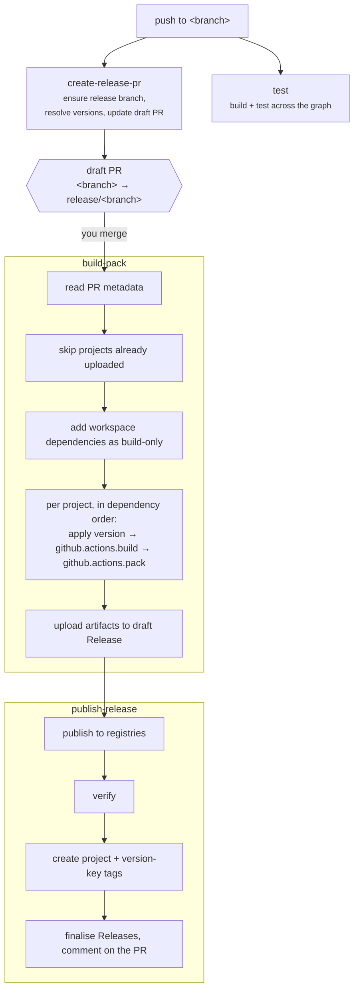

# Release Pipeline

Two events drive everything: **a push to a branch**, and **a pull request merged into
`release/**`**.

| Event                                  | Workflow                 | What runs                                                                  |
| -------------------------------------- | ------------------------ | -------------------------------------------------------------------------- |
| push to any branch except `release/**` | `create-release-pr.yml`  | Ensure the release branch, create or update the draft release pull request |
| push to any branch except `release/**` | `test.yml`               | Build and test every project                                               |
| pull request merged into `release/**`  | `build-pack-publish.yml` | `build-pack`, then `publish-release`                                       |
| daily schedule                         | `cleanup-scheduled.yml`  | Prune superseded prerelease builds                                         |

Testing is deliberately not part of the release path. It runs on every commit regardless of whether
a release is coming, so a red test result is visible before you merge the release pull request
rather than at the moment of publishing.

## On push: the release pull request

`create-release-pr` does three things:

1. Ensures `release/<branch>` exists, creating it if needed.
2. Resolves the version for every project, per version key — see [Versioning](Versioning).
3. Creates or updates a **draft** pull request from `<branch>` into `release/<branch>`, writing the
   resolved versions into the body as YAML.

The body's metadata block is the pipeline's input, not decoration:

````markdown
```yaml
MAIN:
  projects:
    - name: '@org/api'
      version: 2.1.0
      prerelease: false
      cwd: packages/api
    - name: '@org/web'
      version: 2.1.0
      prerelease: false
      cwd: packages/web
```

- [ ] Force Rebuild
````

`build-pack` and `publish-release` read this back. The versions that get built are the versions
recorded when the pull request was last updated — the ones you can see and review — not versions
recomputed against a branch that may have moved.

Ticking **Force Rebuild** before merging deletes the existing draft releases first, discarding any
partial work from an earlier attempt.

The workflow uses a concurrency group per branch so that rapid pushes cancel redundant in-flight
runs rather than racing to update the same pull request.

## On merge: build and pack

The `build-pack` job runs first.

**Plugins are loaded once**, before anything is dispatched, so artifact types supplied by installed
packages are available. See [Plugins](Plugins).

**Completed projects are skipped.** For each project in the metadata, git-flow looks for a draft
release tagged `{project}/v{version}` containing that project's `.artifact.yml`. If it is there, the
project is already done and is not rebuilt. This is what makes a failed release resumable: fix the
cause, re-run, and only the outstanding projects are processed.

**Dependencies are added to the build set.** Projects the release targets are found in the
workspace, then their workspace dependencies are added recursively. Those extra projects are built
but not packed or published — they are marked `build-only` in the execution plan.

**Builds run through the dependency graph.** git-flow calls the parallel runner from
[`@cpdevtools/ts-dev-utilities`](https://github.com/cpdevtools/ts-dev-utilities/wiki), with
`failFast` on: each project runs `github.actions.build` as soon as its own workspace dependencies
have succeeded.

Around each build:

- **Before**, the real version is written into the project's manifests (`gitflow apply-version`) and
  `PROJECT_VERSION` is set for that project.
- **After a successful build**, if the project is being released, `github.actions.pack` runs and the
  resulting artifacts are uploaded to that project's draft GitHub Release.

Every project therefore gets its own draft release, tagged `{project}/v{version}`, with its
artifacts and its `.artifact.yml` descriptor attached.

## On merge: publish and finalise

The `publish-release` job runs after `build-pack` succeeds.

1. Read each project's `.artifact.yml`.
2. Publish every artifact to each registry it names, using the credentials in
   [`.publish/registries.yml`](Registries).
3. Verify each publish by looking the package up at the released version.
4. Create the tags — `{project}/v{version}` for each project, `{key}/v{version}` for each version
   key.
5. Finalise the GitHub Releases and link them back to the pull request in a comment.

Verification is keyed off the **registry** type rather than the artifact type, so any artifact type
that publishes through an npm or NuGet registry gets post-publish checks without adding anything.

## The whole path



## Deploying is separate

Merging publishes. It does not deploy.

A published release is a candidate; deciding that a particular environment should run it is a
separate action, taken by a person, with `gitflow deploy`. See [Deployment](Deployment).
