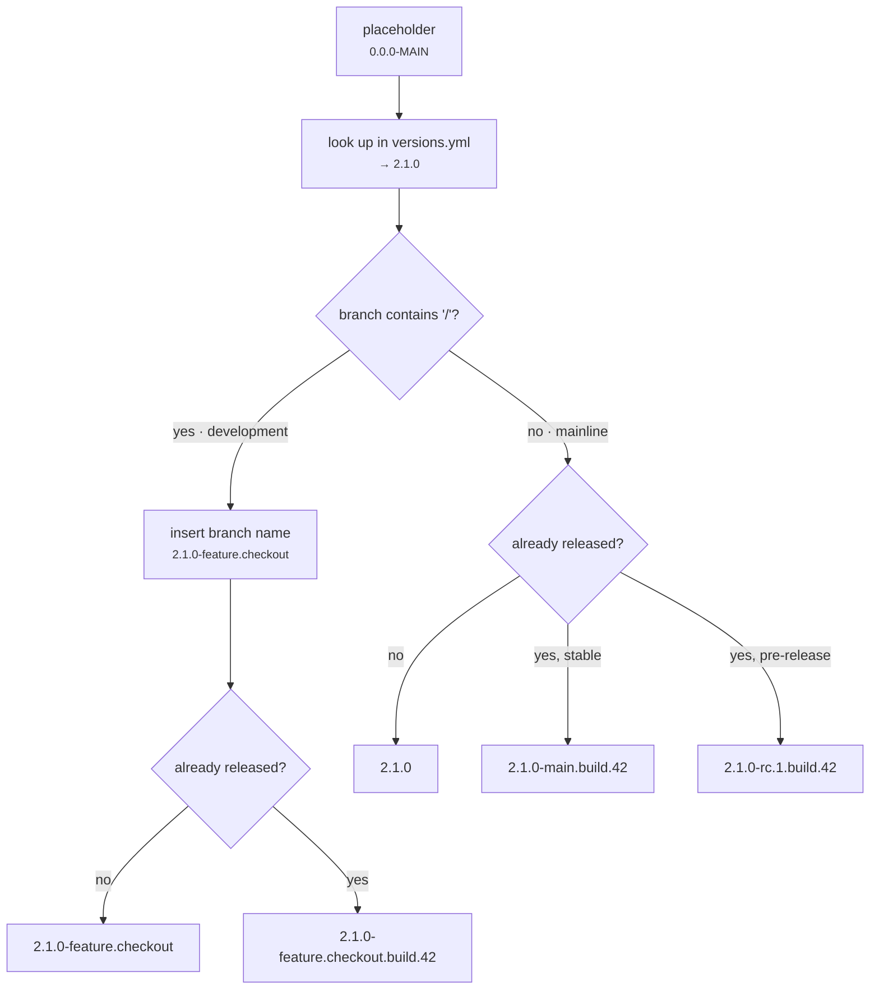

# Versioning

No manifest in a git-flow repository contains a real version number. Every `package.json` (and
`.csproj`, and anything else that carries one) holds a **placeholder**, and the real version lives
in a single file.

```jsonc
// packages/api/package.json
{
  "name": "@org/api",
  "version": "0.0.0-MAIN",
}
```

```yaml
# .publish/versions.yml
'0.0.0-MAIN': 2.2.0-dev.0
```

## Why versions are not in the manifests

**Manifests would otherwise change on every release.** Bumping ten packages means ten edited files
in a commit that says nothing about the change. With a placeholder, the release commit touches one
line in one file.

**Version numbers stop causing merge conflicts.** Two branches that both released will conflict on
every bumped manifest. They conflict on one line here, in a file whose whole purpose is to be
merged deliberately.

**The version can depend on the branch, which a manifest cannot.** A manifest is one value; the
resolved version has to differ per branch, and differ again when a version has already been
published. Placeholder plus resolution gives one committed value and many resolved ones.

**The versions file is branch-specific, and that is the mechanism behind maintenance lines.** `main`
and `v1.3` share the `MAIN` key; each branch's copy of the file resolves it to a different track.
See [Branch Model](Branch-Model).

The real version is substituted into the manifests at build time by `gitflow apply-version`, which
runs inside the pipeline. The substituted manifests are never committed.

## Version keys

A key is a placeholder of the form `0.0.0-<NAME>`, and its display name is the part after the
prefix. A project joins a key by using it as its `version`.

```yaml
# .publish/versions.yml
'0.0.0-MAIN': 2.2.0-dev.0
'0.0.0-BETA': 1.0.0-beta.0
```

Every project on `0.0.0-MAIN` moves together and releases together, under one version number. A
project on `0.0.0-BETA` moves on its own schedule. Most repositories need exactly one key; add a
second only when a group of projects genuinely versions independently.

The file is found at `.publish/versions.yml`, falling back to `.github/versions.yml`.

## Resolving a version

Resolution takes the placeholder, the branch, and the CI run number, and produces the version that
will actually be built.



### Mainline branches

1. Look the placeholder up in the versions file.
2. If that version has not been released, use it unchanged.
3. If it has been released, append a build suffix:
   - the resolved version is stable → `-<branch>.build.<run>`, e.g. `2.1.0-main.build.42`
   - the resolved version is already a pre-release → `.build.<run>`, e.g. `2.1.0-rc.1.build.42`

### Development branches

1. Look the placeholder up in the versions file.
2. Insert the sanitised branch name as the first pre-release identifier:
   - `2.1.0` → `2.1.0-feature.checkout`
   - `2.1.0-beta.0` → `2.1.0-feature.checkout.beta.0`
3. If that version has been released, append `.build.<run>`.

The result is always a pre-release, whatever the versions file says.

### Reference table

| Branch             | Versions file  | Already released? | Result                            |
| ------------------ | -------------- | ----------------- | --------------------------------- |
| `main`             | `2.1.0`        | no                | `2.1.0`                           |
| `main`             | `2.1.0`        | yes               | `2.1.0-main.build.42`             |
| `main`             | `2.1.0-rc.1`   | no                | `2.1.0-rc.1`                      |
| `main`             | `2.1.0-rc.1`   | yes               | `2.1.0-rc.1.build.42`             |
| `v1.3`             | `1.3.5`        | no                | `1.3.5`                           |
| `feature/checkout` | `2.1.0`        | no                | `2.1.0-feature.checkout`          |
| `feature/checkout` | `2.1.0`        | yes               | `2.1.0-feature.checkout.build.42` |
| `feature/checkout` | `2.1.0-beta.0` | no                | `2.1.0-feature.checkout.beta.0`   |

The build suffix means **every commit produces an installable, traceable version**, without a human
having to invent one and without any commit ever overwriting a published version.

### Branch-name sanitisation

Slashes become dots; anything outside `[A-Za-z0-9.-]` becomes a dot.

```
feature/checkout          → feature.checkout
team/frontend/dark-mode   → team.frontend.dark-mode
fix/bug#123               → fix.bug.123
```

### "Already released" means more than a tag

The check looks for the tag locally, then on the remote, and then inspects the draft GitHub Release
body for artifacts marked published. The last step is what makes a failed release resumable: if a
run created a draft release but published nothing, the version is still considered available and
re-running continues rather than skipping to a build suffix.

## Setting a version

```bash
gitflow version
```

The command reads the current resolved version for a key and offers the legal next steps. It does
not accept a free-form version, and it will not offer one that collides with an existing tag.

```
◇  Version key   MAIN
◇  Current       2.1.0-beta.22   pre-release

◆  How should the version change?
   ─ finish this pre-release ───────────────────────────────
   ❯ release           2.1.0          drop pre-release, ship it
   ─ stay in pre-release ───────────────────────────────────
     next              2.1.0-beta.23  next in beta channel
     → rc              2.1.0-rc.0     beta → rc
   ─ start the next version ─────────────────────────────────
     patch             2.1.1-alpha.0  pre-release
     patch             2.1.1          stable
     minor             2.2.0-alpha.0  pre-release
     major             3.0.0-alpha.0  pre-release
```

What is on offer depends on the current version:

| Current          | Offered                                                                                       |
| ---------------- | --------------------------------------------------------------------------------------------- |
| a pre-release    | finish it, advance within its channel, move up a channel, or start the next patch/minor/major |
| a stable version | start the next patch/minor/major, as either a pre-release or a stable version                 |

**Channels are `alpha` → `beta` → `rc`, in that order, and the order is not arbitrary.** Semver
compares pre-release identifiers as ASCII strings, so `alpha` < `beta` < `rc` sorts correctly by
accident of spelling. Channels only ever move forward: from `beta` you may go to `rc`, never back.

**An option that would collide is shown but not selectable.** A candidate is blocked if its exact
tag exists, and a pre-release candidate is also blocked if the _stable_ version is already tagged —
publishing `2.0.0-rc.1` after `2.0.0` has shipped would be a version that sorts below something
already released.

`gitflow version` writes `.publish/versions.yml` and commits. Use `--key <NAME>` to choose a key
without prompting, and `--no-commit` to leave the change staged.

## Tags

Publishing creates tags per project and per version key:

```
@org/api/v2.1.0        one per published project
MAIN/v2.1.0            one per version key
```

Project tags are what "already released" checks against, which is why two projects on different
keys can hold the same version number without colliding.

They are also what publishing reads to decide whether a version is the highest of its kind and so
earns a `latest` / `next` / channel pointer on Docker and npm — see
[Floating tags](Artifacts#floating-tags).
